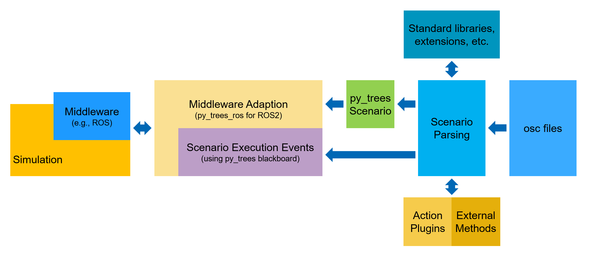

Architecture
============

   Architecture of Scenario Execution

The scenario execution contains several sub-packages, namely

-  `scenario_execution_base <#scenario-execution-base-package>`__
-  `scenario_execution <#scenario-execution-package>`__
-  `scenario_execution_gazebo <#scenario-execution-gazebo-package>`__
-  `scenario_execution_control <#scenario-execution-control-package>`__
-  `scenario_execution_interfaces <#scenario-execution-interfaces-package>`__
-  `scenario_execution_rviz <#scenario-execution-rviz-package>`__
-  `scenario_execution_kubernetes <#scenario-execution-kubernetes-package>`__

The architecture aims at modularity with each package implementing a
specific functionality.

Parsing
~~~~~~~

.. figure:: images/parsing.png
   :alt: Architecture of Scenario Parsing

   Architecture of Scenario Parsing

Modules
=======

Scenario Execution Base Package
~~~~~~~~~~~~~~~~~~~~~~~~~~~~~~~

The “scenario_execution_base” package is the base package for scenario
execution. It provides functionalities like parsing and base classes.
For more documentation of this package, please refer to :repo_link:`scenario_execution_base/README.md`.

Scenario Execution Package
~~~~~~~~~~~~~~~~~~~~~~~~~~

The “scenario_execution” package uses ROS2 as middleware and contains
ROS2-specific modules. For more documentation of this package, please
refer to :repo_link:`scenario_execution/README.md`.

Scenario Execution Gazebo Package
~~~~~~~~~~~~~~~~~~~~~~~~~~~~~~~~~

The “scenario_execution_gazebo” package is an extension of the
“scenario_execution” package with Gazebo/AMR dependencies. For more
documentation of this package, please refer to :repo_link:`scenario_execution_gazebo/README.md`.

Scenario Execution Control Package
~~~~~~~~~~~~~~~~~~~~~~~~~~~~~~~~~~

The “scenario_execution_control” package provides code to control
scenarios (in ROS2) from another application such as Rviz. For more
documentation of this package, please refer to :repo_link:`scenario_execution_control/README.md`.

Scenario Execution Interfaces Package
~~~~~~~~~~~~~~~~~~~~~~~~~~~~~~~~~~~~~

The “scenario_execution_interfaces” package provides ROS2
`interfaces <https://docs.ros.org/en/rolling/Concepts/Basic/About-Interfaces.html>`__,
more specifically, messages and services, which are used to interface
ROS2 with the scenario execution control package. For more
documentation of this package, please refer to :repo_link:`scenario_execution_interfaces/README.md`.

Scenario Execution Rviz Package
~~~~~~~~~~~~~~~~~~~~~~~~~~~~~~~

The “scenario execution rviz” package contains code for several
`rviz <https://github.com/ros2/rviz>`__ plugins for visualizing and
controlling scenarios when working with `ROS
2 <https://docs.ros.org/en/rolling/index.html>`__. For more
documentation of this package, please refer to :repo_link:`scenario_execution_rviz/README.md`.

Scenario Execution Kubernetes Package
~~~~~~~~~~~~~~~~~~~~~~~~~~~~~~~~~~~~~

The “scenario_execution_kubernetes” package contains custom conditions
and actions when running scenarios inside a
`Kubernetes <https://kubernetes.io/>`__ cluster. For more documentation
of this package, please refer to :repo_link:`scenario_execution_kubernetes/README.md`.
