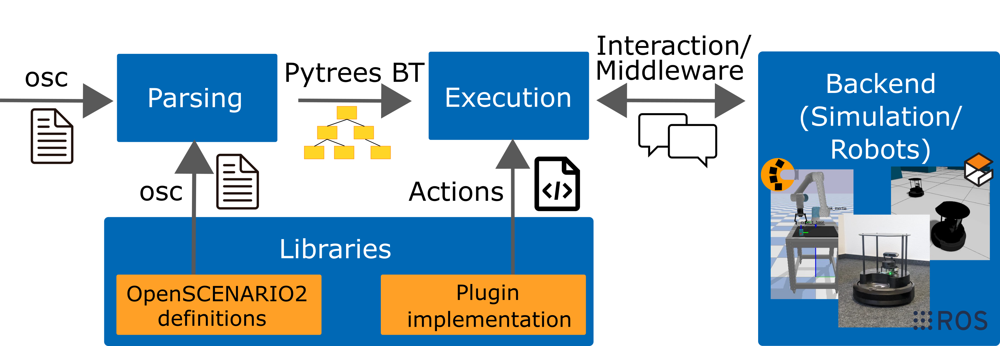

Architecture
============

.. figure:: images/scenario_execution_structure.png
   :alt: Overview of Scenario Execution

   Overview of Scenario Execution

Scenario execution is built as a Python library on top of two open-source components: the generic scenario description language `OpenSCENARIO 2 <https://www.asam.net/index.php?eID=dumpFile&t=f&f=3460&token=14e7c7fab9c9b75118bb4939c725738fa0521fe9>`_ and `PyTrees  <https://py-trees.readthedocs.io/en/devel/introduction.html>`_.
In general, the user defines a scenario in the OpenSCENARIO 2 language, scenario execution parses the scenario, translates it to a behavior tree, executes it and finally gathers the test results.

   Architecture of Scenario Execution

Our implementation is highly modular separating the core components from simulation- and/or middleware-specific modules realized through a plugin-based approach. 
In principle, any additional feature that is required by a specific scenario and that can be implemented in Python could be realized as additional library.
A library typically provides an OpenSCENARIO 2 file with additional definitions and may provide code implementing additional functionality such as conditions or actions.

Currently, the following sub-packages and libraries are available:

-  :repo_link:`scenario_execution`
-  :repo_link:`scenario_execution`
-  :repo_link:`scenario_execution_gazebo`
-  :repo_link:`scenario_execution_control`
-  :repo_link:`scenario_execution_interfaces`
-  :repo_link:`scenario_execution_rviz`

Design for Modularity
---------------------

Scenario execution is designed to be easily extensible through libraries.
An example is available here: :ref:`scenario_library`.

The entry points are defined like this:

.. code-block::

  entry_points={
   'scenario_execution.actions': [
       'custom_action = example_library.custom_action:CustomAction',
   ],
    'scenario_execution.osc_libraries': [
        'example = example_library.get_osc_library:get_example_library',
    ]
  }

Scenario Parsing
----------------

.. figure:: images/parsing.png
   :alt: Architecture of Scenario Parsing

   Architecture of Scenario Parsing

The Internal Model Builder, implemented as a Model Listener does an initial check of the model by checking for supported language features. The Internal Model Resolver, implemented as a Model Visitor is used for type/variable resolving and does an in depth consistency check of the model.

Modules
-------

- ``scenario_execution``: The base package for scenario execution. It provides the parsing of OpenSCENARIO 2 files and the conversion to py-trees. It's middleware agnostic and can therefore be used as a basis for more specific implementations (e.g. ROS). It also provides basic OpenSCENARIO 2 libraries and actions.
- ``scenario_execution``: This package uses ``scenario_execution`` as a basis and implements a ROS2 version of scenario execution. It provides a OpenSCENARIO 2 library with basic ROS2-related actions like publishing on a topic or calling a service.
- ``scenario_execution_control``: Provides code to control scenario execution (in ROS2) from another application such as RViz.
- ``scenario_coverage``: Provides tools to generate concrete scenarios from abstract OpenSCENARIO 2 scenario definition and execute them.
- ``scenario_execution_gazebo``: Provides a `Gazebo <https://gazebosim.org/>`_-specific OpenSCENARIO 2 library with actions.
- ``scenario_execution_interfaces``: Provides ROS2 `interfaces <https://docs.ros.org/en/rolling/Concepts/Basic/About-Interfaces.html>`__, more specifically, messages and services, which are used to interface ROS2 with the ``scenario_execution_control`` package.
- ``scenario_execution_rviz``: Contains several `rviz <https://github.com/ros2/rviz>`__ plugins for visualizing and controlling scenarios when working with ROS2.
- ``simulation/gazebo_tf_publisher``: Publish ground truth transforms from simulation within TF.
- ``simulation/tb4_sim_scenario``: Run `Turtlebot4 <https://turtlebot.github.io/turtlebot4-user-manual/software/turtlebot4_simulator.html>`_ within simulation, controlled by scenario execution.
- ``tools/message_modification``: ROS2 nodes to modify messages.
- ``tools/scenario_status``: Publish the current scenario status on a topic (e.g. to be capture within a ROS bag).
