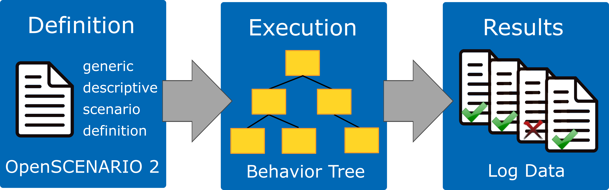
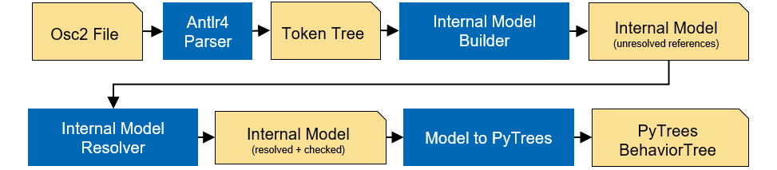

Architecture
============

   Architecture of Scenario Execution

The scenario execution contains several sub-packages, namely

-  `scenario_execution_base <#scenario-execution-base-package>`__
-  `scenario_execution <#scenario-execution-package>`__
-  `scenario_execution_gazebo <#scenario-execution-gazebo-package>`__
-  `scenario_execution_control <#scenario-execution-control-package>`__
-  `scenario_execution_interfaces <#scenario-execution-interfaces-package>`__
-  `scenario_execution_rviz <#scenario-execution-rviz-package>`__
-  `scenario_execution_kubernetes <#scenario-execution-kubernetes-package>`__

The architecture aims at modularity with each package implementing a
specific functionality.

Design for Modularity
---------------------

Scenario execution is designed to be easily extensible through libraries.
An example is available here: :ref:`scenario_library`.

The entry points are defined like this:

.. code-block::

  entry_points={
   'scenario_execution.actions': [
       'custom_action = example_library.custom_action:CustomAction',
   ],
    'scenario_execution.osc_libraries': [
        'example = example_library.get_osc_library:get_example_library',
    ]
  }

Scenario Parsing
----------------

   Architecture of Scenario Parsing

Modules
-------

- ``scenario_execution_base``: The base package for scenario execution. It provides the parsing of OpenSCENARIO 2 files and the conversion to py-trees. It's middleware agnostic and can therefore be used as a basis for more specific implementations (e.g. ROS). It also provides basic OpenSCENARIO 2 libraries and actions.
- ``scenario_execution``: This package uses ``scenario_execution_base`` as a basis and implements a ROS2 version of scenario execution. It provides a OpenSCENARIO 2 library with basic ROS2-related actions like publishing on a topic or calling a service.
- ``scenario_execution_control``: Provides code to control scenario execution (in ROS2) from another application such as RViz.
- ``scenario_coverage``: Provides tools to generate concrete scenarios from abstract OpenSCENARIO 2 scenario definition and execute them.
- ``scenario_execution_gazebo``: Provides a `Gazebo <https://gazebosim.org/>`_-specific OpenSCENARIO 2 library with actions.
- ``scenario_execution_interfaces``: Provides ROS2 `interfaces <https://docs.ros.org/en/rolling/Concepts/Basic/About-Interfaces.html>`__, more specifically, messages and services, which are used to interface ROS2 with the ``scenario_execution_control`` package.
- ``scenario_execution_rviz``: Contains several `rviz <https://github.com/ros2/rviz>`__ plugins for visualizing and controlling scenarios when working with ROS2.
- ``simulation/gazebo_tf_publisher``: Publish ground truth transforms from simulation within TF.
- ``simulation/tb4_sim_scenario``: Run `Turtlebot4 <https://turtlebot.github.io/turtlebot4-user-manual/software/turtlebot4_simulator.html>`_ within simulation, controlled by scenario execution.
- ``tools/message_modification``: ROS2 nodes to modify messages.
- ``tools/scenario_status``: Publish the current scenario status on a topic (e.g. to be capture within a ROS bag).