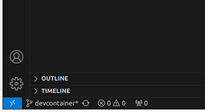
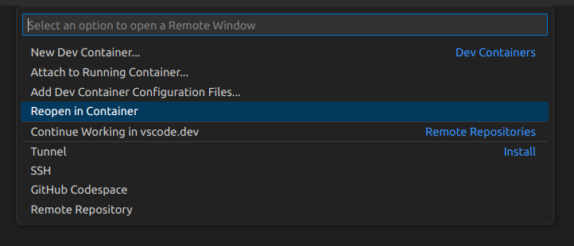
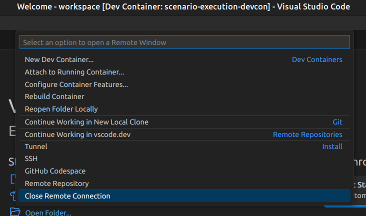

How to run
==========

Run locally with ROS2
---------------------

First, build the packages:

.. code-block:: bash

   colcon build --packages-up-to scenario_execution_gazebo
   source install/setup.bash

To launch an osc-file with ROS2, use the default launch file:

.. code-block:: bash

   ros2 launch scenario_execution scenario_launch.py scenario:=$(PATH_TO_SCENARIO_FILE) debug:=True log-level:=debug

To run an osc-file with ROS2:

.. code-block:: bash

   ros2 run scenario_execution scenario_execution $(PATH_TO_SCENARIO_FILE)

Use the ``-t`` flag to see the printed tree and use the ``-d`` flag to see debug
information of py_trees and the parser:

.. code-block:: bash

   ros2 run scenario_execution scenario_execution $(PATH_TO_SCENARIO_FILE) -t -d

Run as standalone Python package without ROS2
---------------------------------------------

After installing :repo_link:`scenario_execution_base` using pip (see :ref:`install_with_pip`), you can execute a scenario with the following command

.. code-block:: bash

   scenario_execution_base $(PATH_TO_SCENARIO_FILE)

Use the ``-t`` flag to see the printed tree and use the ``-d`` flag to see debug
information of py_trees and the parser:

.. code-block:: bash

   scenario_execution_base $(PATH_TO_SCENARIO_FILE) -t -d

Run with Development Container inside Visual Studio Code
--------------------------------------------------------

Prerequisites
^^^^^^^^^^^^^

If not already installed, install the docker engine on your system according to the `installation instructions <https://docs.docker.com/engine/install/>`_ or, if you need GPU support, follow the `nvidia installation instructions <https://docs.nvidia.com/datacenter/cloud-native/container-toolkit/install-guide.html>`_.

Make sure you follow the `post installation steps <https://docs.docker.com/engine/install/linux-postinstall/>`_.

To make sure, that the docker daemon is properly set up, run

.. code-block:: bash

   docker run hello-world

Make sure you have installed the necessary `Visual Studio Code <https://code.visualstudio.com/>`_ extensions, namely the `docker extension <https://code.visualstudio.com/docs/containers/overview>`_ as well as the `Dev Container <https://marketplace.visualstudio.com/items?itemName=ms-vscode-remote.remote-containers>`_ extension.

Open Scenario Execution in Development Container
^^^^^^^^^^^^^^^^^^^^^^^^^^^^^^^^^^^^^^^^^^^^^^^^

First, build the packages:

.. code-block:: bash

   colcon build

Now, open the root folder of the `scenario execution repository <https://github.com/intellabs/scenario_execution>`_ in Visual Studio Code by running 

.. code-block:: bash

   code /path/to/scenario_execution

in a terminal.
Make sure, that your ``ROS_DOMAIN_ID`` is properly set in the terminal you start Visual Studio Code from.
Then, click the blue item in the lower left corner

Afterwards, select "Reopen in Container " in the Selection Window inside Visual Studio Code

Now Visual Studio Code should build the development container and open your current working directory inside the container after it successfully built the image.
If you now open a terminal inside Visual Studio Code, you can run and test your development safely inside the development container by running any of the :repo_link:`examples` (see :ref:`tutorials` for further details).

Once you are done, you can cancel the remote connection, by again clicking on the blue item in the lower left corner and select "Close Remote Connection"

Visualize Scenario with PyTrees ROS Viewer
------------------------------------------

Before getting started, ensure that the PyQt5 version 5.14 Python library is installed. You can check PyQt5 version using the following command:

.. code-block:: bash

   pip freeze | grep -i pyqt

If any PyQt5 libraries are detected, it's recommended to uninstall them to avoid conflicts:

.. code-block:: bash

   pip3 uninstall PyQt5 PyQt5-Qt5 PyQt5-sip PyQtWebEngine PyQtWebEngine-Qt5

Additionally, if the default PyQtWebEngine is present, remove it using:

.. code-block:: bash

   sudo apt remove python3-pyqt5.qtwebengine

Next, install PyQt and PyQtWebEngine version 5.14:

.. code-block:: bash

   pip install PyQt5==5.14
   pip install PyQtWebEngine==5.14

Once PyQt is set up, clone the ``py_trees_ros_viewer`` repository:

.. code-block:: bash

   git clone git@github.com:splintered-reality/py_trees_ros_viewer.git

After cloning, build the package using ``colcon build`` and source the workspace.

Now, to open the viewer, execute the following command:

.. code-block:: bash

   py-trees-tree-viewer --no-sandbox

Finally, in a separate terminal, run the scenario file to visualize the behavior tree.

Example:

.. code-block:: bash

      ros2 launch scenario_execution scenario_launch.py scenario:=examples/example_scenario/hello_world.osc

.. figure:: images/py_tree_viewer.png
   :alt: Behavior Tree Viewer 

Please note that this method has been tested on Ubuntu 22.04. If you are using any other distribution, please ensure that 
PyQtEngine works on your machine and render web pages correctly.

Scenario Coverage
-----------------
``Scenario Coverage`` is a tool designed to run variations of a scenario from a single scenario definition. It offers a fast and efficient method to test scenario with different attribute values, streamlining the development and testing process.

Below are the steps to run a scenario using ``scenario_coverage``..

First, build the packages:

.. code-block:: bash

   colcon build --packages-up-to scenario_coverage
   source install/setup.bash

Then, generate the scenario files for each variation of scenario  using the ``scenario_variation`` executable, you can pass your own custom scenario as an input. For this exercise, we will use a scenario present in  :repo_link:`examples/example_scenario_variation/`.

.. code-block:: bash

   scenario_variation examples/example_scenario_variation/example_scenario_variation.osc

This will save scenario variation files with the ``.sce`` extension in the ``out`` folder within the current working directory.

Now to execute all scenario variation, simply run the scenario_coverage executable. This command will process all scenarios files present in the ``out`` folder and execute the scenes accordingly.

.. code-block:: bash

   scenario_batch_execution -i out -o scenario_output -- ros2 launch scenario_execution scenario_launch.py scenario:={SCENARIO} output_dir:={OUTPUT_DIR}

above command requires three arguments.

    1. Directory where the scenario files ``.sce`` were saved as the input option ``-i``.
    2. Directory where the output ``log`` and ``xml`` files will be saved as the output option ``-o``.
    3. Launch command to launch scenarios ``-- ros2 launch scenario_execution scenario_launch.py scenario:={SCENARIO} output_dir:={OUTPUT_DIR}``.

Finally, The output of the above command will display two values ``foo`` and ``bar`` on the terminal along with the success message.
