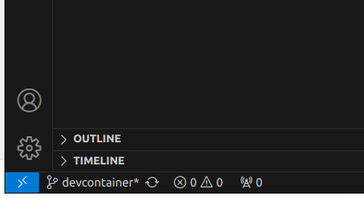
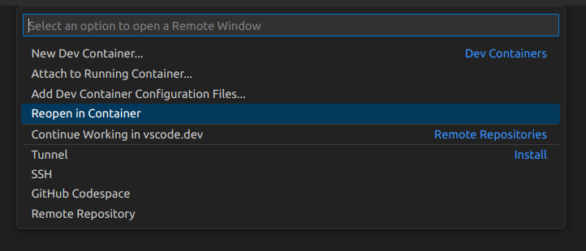
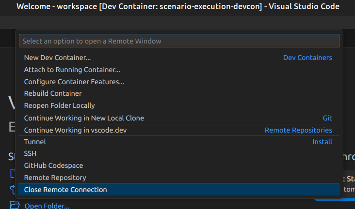

How to run
==========

With devcontainer
-----------------

Preparations
~~~~~~~~~~~~

If not already installed, install the docker engine on your system
according to the `installation
instructions <https://docs.docker.com/engine/install/>`__ or, if you
need GPU support, follow the `nvidia installation
instructions <https://docs.nvidia.com/datacenter/cloud-native/container-toolkit/install-guide.html>`__.
The recommended nvidia driver package is ``nvidia-driver-525``.

Make sure you follow the `post installation
steps <https://docs.docker.com/engine/install/linux-postinstall/>`__.

Post-installation, you need to configure the proxy behavior of the
docker daemon:

.. code-block:: bash

   sudo mkdir -p /etc/systemd/system/docker.service.d
   sudo echo -e "[Service]\nEnvironment="HTTP_PROXY=http://proxy-chain.intel.com:911"\nEnvironment="HTTPS_PROXY=http://proxy-chain.intel.com:912"\nEnvironment="NO_PROXY=*.intel.com,127.0.0.0/8,localhost,127.0.0.1"" > /etc/systemd/system/docker.service.d/http-proxy.conf
   sudo systemctl -q daemon-reload
   sudo systemctl -q restart docker

To make sure, that the docker daemon is properly set up, run

.. code-block:: bash

   docker run hello-world

Install additional packages to build amsrl containers (buildkit).

.. code-block:: bash

   sudo apt install docker-buildx-plugin

Follow these
`instructions <https://intel.sharepoint.com/sites/caascustomercommunity/SitePages/CaaS%20-%20Containers%20as%20a%20Service/News1915835.aspx#>`__
for using the Intel image registry.

Particularly, install the Intel internal CAs following these
`instructions <https://github.intel.com/CaaS/public/blob/master/ca_install.md>`__.
Now, you should be ready to login to be able to pull docker images.

.. code-block:: bash

   docker login ger-registry-pre.caas.intel.com

.. note::
   In case you want to use the devcontainer with `Visual Studio
   Code <https://code.visualstudio.com/>`__, you also need to install
   docker-compose via

   .. code-block:: bash

      sudo apt update
      sudo apt install docker-compose

Run devcontainer from terminal
~~~~~~~~~~~~~~~~~~~~~~~~~~~~~~

Prior to the actual start of the container, run

.. code-block:: bash

   xhost + local:ros

To start the devcontainer without GPU-support, run the following command
*from the root directory of this repository*

.. code-block:: bash

   bash containers/run_cpu.sh

To start the devcontainer with GPU-support, run the following command
*from the root directory of this repository*

.. code-block:: bash

   bash containers/run_gpu.sh

Inside the devcontainer, you can now safely run and test your
development, e.g., run

.. code-block:: bash

   ros2 run scenario_execution scenario_execution scenario_execution_base/scenarios/demo_wait_and_log.osc -t

For a more sophisticated example using a simulated
`Turtlebot4 <https://turtlebot.github.io/turtlebot4-user-manual/>`__ and
`Nav2 <https://navigation.ros.org/>`__, run

.. code-block:: bash

   ros2 launch scenario_execution_tutorials turtlebot4_simulation_nav2_to_pose_tutorial_launch.py headless:=False

and you should something like this

.. figure:: images/tb4_scenario.gif
   :alt: turtlebot4 nav2 scenario

   turtlebot4 nav2 scenario

In case you need an additional terminal inside your running
devcontainer, run

.. code-block:: bash

   bash containers/exec.sh

When you are done with testing, please run

.. code-block:: bash

   xhost - local:ros

Run devcontainer from Visual Studio Code
~~~~~~~~~~~~~~~~~~~~~~~~~~~~~~~~~~~~~~~~

.. note::
   Make sure you have installed the necessary VS Code extensions, namely
   the `docker extension <https://code.visualstudio.com/docs/containers/overview>`__ as
   well as the `Dev
   Container <https://marketplace.visualstudio.com/items?itemName=ms-vscode-remote.remote-containers>`__
   extension.

Open the root folder of this repository in Visual Studio Code
and click the blue item in the lower left corner

Afterwards, select “Reopen in Container” in the Selection Window inside
VS Code

Now VS Code should open your current working directory inside the
devcontainer. If you now open a terminal inside VS Code, you can run and
test your development safely inside the container, e.g., run

.. code-block:: bash

   ros2 run scenario_execution scenario_execution scenario_execution_base/scenarios/demo_wait_and_log.osc -t

For a more sophisticated example using a simulated
`Turtlebot4 <https://turtlebot.github.io/turtlebot4-user-manual/>`__ and
`Nav2 <https://navigation.ros.org/>`__, run

.. code-block:: bash

   ros2 launch scenario_execution_tutorials turtlebot4_simulation_nav2_to_pose_tutorial_launch.py headless:=False

and you should something like this

.. figure:: images/tb4_scenario.gif
   :alt: turtlebot4 nav2 scenario

   turtlebot4 nav2 scenario

Once you are done, you can cancel the remote connection, by again
clicking on the blue item in the lower left corner and select “Close
Remote Connection”

With local installation
-----------------------

First, build the packages:

.. code-block:: bash

   colcon build --packages-up-to scenario_execution_gazebo
   source install/setup.bash

To launch an osc-file with ROS2, use the default launch file:

.. code-block:: bash

   ros2 launch scenario_execution scenario_launch.py scenario:=$(PATH_TO_SCENARIO_FILE) debug:=True log-level:=debug

To run an osc-file with ROS2:

.. code-block:: bash

   ros2 run scenario_execution scenario_execution $(PATH_TO_SCENARIO_FILE)

Use ``-t`` flag to see the printed tree and use ``-d`` flag to see debug
information of py_trees and parser:

.. code-block:: bash

   ros2 run scenario_execution scenario_execution $(PATH_TO_SCENARIO_FILE) -t -d
