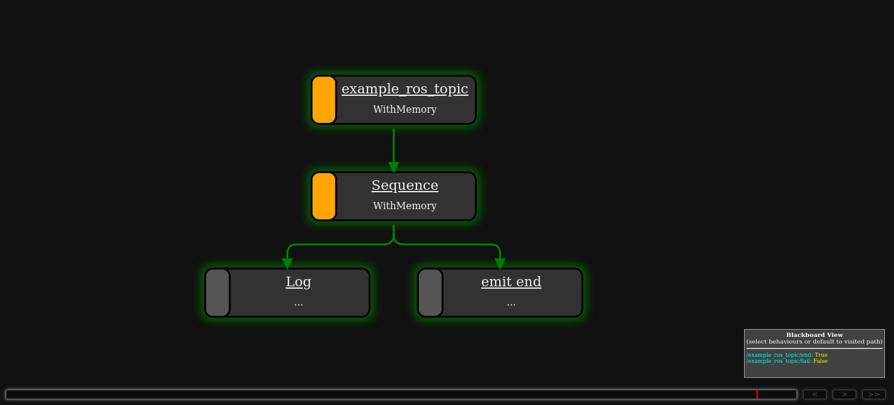

How to run
==========

First, build the packages:

.. code-block:: bash

   colcon build --packages-up-to scenario_execution_gazebo
   source install/setup.bash

To launch an osc-file with ROS2, use the default launch file:

.. code-block:: bash

   ros2 launch scenario_execution scenario_launch.py scenario:=$(PATH_TO_SCENARIO_FILE) debug:=True log-level:=debug

To run an osc-file with ROS2:

.. code-block:: bash

   ros2 run scenario_execution scenario_execution $(PATH_TO_SCENARIO_FILE)

Use ``-t`` flag to see the printed tree and use ``-d`` flag to see debug
information of py_trees and parser:

.. code-block:: bash

   ros2 run scenario_execution scenario_execution $(PATH_TO_SCENARIO_FILE) -t -d

Using RVIZ to trigger scenario
------------------------------

Visualize Scenario with PyTrees ROS Viewer
------------------------------------------

Before getting started, ensure that the PyQt5 version 5.14 Python library is installed. You can check PyQt5 version using the following command:

.. code-block:: bash

   pip freeze | grep -i pyqt

If any PyQt5 libraries are detected, it's recommended to uninstall them to avoid conflicts:

.. code-block:: bash

   pip3 uninstall PyQt5 PyQt5-Qt5 PyQt5-sip PyQtWebEngine PyQtWebEngine-Qt5

Additionally, if the default PyQtWebEngine is present, remove it using:

.. code-block:: bash

   sudo apt remove python3-pyqt5.qtwebengine

Next, install PyQt and PyQtWebEngine version 5.14:

.. code-block:: bash

   pip install PyQt5==5.14
   pip install PyQtWebEngine==5.14

Once PyQt is set up, clone the ``py_trees_ros_viewer`` repository:

.. code-block:: bash

   git clone git@github.com:splintered-reality/py_trees_ros_viewer.git

After cloning, build the package using ``colcon build`` and source the workspace.

Now, to open the viewer, execute the following command:

.. code-block:: bash

   py-trees-tree-viewer --no-sandbox

Finally, in a separate terminal, run the scenario file to visualize the behavior tree.

Example:

.. code-block:: bash

      ros2 launch scenario_execution scenario_launch.py scenario:=examples/example_scenario/scenarios/example_log.osc

Please note that this method has been tested on Ubuntu 22.04. If you are using any other distribution, please ensure that 
PyQtEngine works on your machine and render web pages correctly.