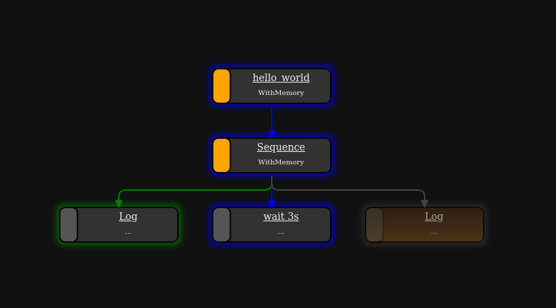

How to run
==========

.. _runtime_parameters:

Runtime Parameters
------------------

.. list-table:: 
   :header-rows: 1
   :class: tight-table   
   
   * - Parameter
     - Description
   * - ``-h`` ``--help``
     - show help message
   * - ``-d`` ``--debug``
     - (For debugging) print internal debugging output
   * - ``--dot``
     - Write [dot|png|svg] of resulting py-tree. Write files to current directory if no ``output-dir`` is given.
   * - ``-l`` ``--log-model``
     - (For debugging) Produce tree output of parsed scenario
   * - ``-n`` ``--dry-run``
     - Parse and resolve scenario, but do not execute
   * - ``-o OUTPUT_DIR`` ``--output-dir OUTPUT_DIR``
     - Directory for output (e.g. test results)
   * - ``-t`` ``--live-tree``
     - (For debugging) Show current state of py tree

Run locally with ROS2
---------------------

First, build the packages:

.. code-block:: bash

   colcon build --packages-up-to scenario_execution_gazebo
   source install/setup.bash

To launch an osc-file with ROS2, use the default launch file:

.. code-block:: bash

   ros2 launch scenario_execution_ros scenario_launch.py scenario:=$(PATH_TO_SCENARIO_FILE) debug:=True log-level:=debug

To run an osc-file with ROS2:

.. code-block:: bash

   ros2 run scenario_execution_ros scenario_execution_ros $(PATH_TO_SCENARIO_FILE)

To log the current state of the behavior tree during execution, add the ``-t`` flag as an argument and run it again:

.. code-block:: bash

   ros2 run scenario_execution_ros scenario_execution_ros $(PATH_TO_SCENARIO_FILE) -t

Additional parameters are describe in section :ref:`runtime_parameters`.

Run as standalone Python package without ROS2
---------------------------------------------

After installing :repo_link:`scenario_execution` using pip (see :ref:`install_with_pip`), you can execute a scenario with the following command

.. code-block:: bash

   scenario_execution $(PATH_TO_SCENARIO_FILE)

To log the current state of the behavior tree during execution, add the ``-t`` flag as an argument and run it again:

.. code-block:: bash

   scenario_execution $(PATH_TO_SCENARIO_FILE) -t

Additional parameters are describe in section :ref:`runtime_parameters`.

Run with Development Container inside Visual Studio Code
--------------------------------------------------------

Prerequisites
^^^^^^^^^^^^^

If not already installed, install the docker engine on your system according to the `installation instructions <https://docs.docker.com/engine/install/>`_ or, if you need GPU support, follow the `nvidia installation instructions <https://docs.nvidia.com/datacenter/cloud-native/container-toolkit/install-guide.html>`_.

Make sure you follow the `post installation steps <https://docs.docker.com/engine/install/linux-postinstall/>`_.

To make sure, that the docker daemon is properly set up, run

.. code-block:: bash

   docker run hello-world

Make sure you have installed the necessary `Visual Studio Code <https://code.visualstudio.com/>`_ extensions, namely the `docker extension <https://code.visualstudio.com/docs/containers/overview>`_ as well as the `Dev Container <https://marketplace.visualstudio.com/items?itemName=ms-vscode-remote.remote-containers>`_ extension.

Open Scenario Execution in Development Container
^^^^^^^^^^^^^^^^^^^^^^^^^^^^^^^^^^^^^^^^^^^^^^^^

First, build the packages:

.. code-block:: bash

   colcon build

Now, open the root folder of the `scenario execution repository <https://github.com/intellabs/scenario_execution>`_ in Visual Studio Code by running 

.. code-block:: bash

   code /path/to/scenario_execution

in a terminal.
Make sure, that your ``ROS_DOMAIN_ID`` is properly set in the terminal you start Visual Studio Code from.
Then, click the blue item in the lower left corner

Afterwards, select "Reopen in Container " in the Selection Window inside Visual Studio Code

Now Visual Studio Code should build the development container and open your current working directory inside the container after it successfully built the image.
If you now open a terminal inside Visual Studio Code, you can run and test your development safely inside the development container by running any of the :repo_link:`examples` (see :ref:`tutorials` for further details).

Once you are done, you can cancel the remote connection, by again clicking on the blue item in the lower left corner and select "Close Remote Connection"

.. figure:: images/vscode3.png
   :alt: Visual Studio Code cancel remote connection

Visualize Scenario with PyTrees ROS Viewer
------------------------------------------

Before getting started, ensure that the PyQt5 version 5.14 Python library is installed. You can check PyQt5 version using the following command:

.. code-block:: bash

   pip freeze | grep -i pyqt

If any PyQt5 libraries are detected, it's recommended to uninstall them to avoid conflicts:

.. code-block:: bash

   pip3 uninstall PyQt5 PyQt5-Qt5 PyQt5-sip PyQtWebEngine PyQtWebEngine-Qt5

Additionally, if the default PyQtWebEngine is present, remove it using:

.. code-block:: bash

   sudo apt remove python3-pyqt5.qtwebengine

Next, install PyQt and PyQtWebEngine version 5.14:

.. code-block:: bash

   pip install PyQt5==5.14
   pip install PyQtWebEngine==5.14

Once PyQt is set up, clone the ``py_trees_ros_viewer`` repository:

.. code-block:: bash

   git clone git@github.com:splintered-reality/py_trees_ros_viewer.git

After cloning, build the package using ``colcon build`` and source the workspace.

Now, to open the viewer, execute the following command:

.. code-block:: bash

   py-trees-tree-viewer --no-sandbox

Finally, in a separate terminal, run the scenario file to visualize the behavior tree.

Example:

.. code-block:: bash

      ros2 launch scenario_execution_ros scenario_launch.py scenario:=examples/example_scenario/hello_world.osc

Please note that this method has been tested on Ubuntu 22.04. If you are using any other distribution, please ensure that 
PyQtEngine works on your machine and render web pages correctly.

Scenario Coverage
-----------------
The ``scenario_coverage`` package provides the ability to run variations of a scenario from a single scenario definition. It offers a fast and efficient method to test scenario with different attribute values, streamlining the development and testing process.

Below are the steps to run a scenario using ``scenario_coverage``..

First, build the packages:

.. code-block:: bash

   colcon build --packages-up-to scenario_coverage
   source install/setup.bash

Then, generate the scenario files for each variation of scenario  using the ``scenario_variation`` executable, you can pass your own custom scenario as an input. For this exercise, we will use a scenario present in  :repo_link:`examples/example_scenario_variation/`.

.. code-block:: bash

   scenario_variation examples/example_scenario_variation/example_scenario_variation.osc

This will save scenario variation files with the ``.sce`` extension in the ``out`` folder within the current working directory.

To execute the generated scenario variations, run the ``scenario_batch_execution`` executable. This command will process all scenarios files present in the ``out`` folder and execute them sequentially.

.. code-block:: bash

   scenario_batch_execution -i out -o scenario_output -- ros2 launch scenario_execution_ros scenario_launch.py scenario:={SCENARIO} output_dir:={OUTPUT_DIR}

above command requires three arguments.

    - ``-i``: directory where the scenario files ``.sce`` are stored
    - ``-o``: directory where the output ``log`` and ``xml`` files will be saved (for each scenario file within a separate folder)
    - ``-- ros2 launch scenario_execution_ros scenario_launch.py scenario:={SCENARIO} output_dir:={OUTPUT_DIR}``: launch command to launch scenarios

.. note::
   ``scenario_batch_execution`` can be used for any scenario-files, not only those generated by ``scenario_variation``.

The return code of ``scenario_batch_execution`` is ``0`` if all tested scenarios succeeded. The output can be found within the specified output-folder:
 
.. code-block:: bash

   <output_folder>/
      text.xml        # overall test result (summary of all tested scenarios)
      <scenario1>/    # directory for scenario
         test.xml     # test result of scenario
         log.txt      # log output of scenario execution
         ...          # other files generated by scenario execution run (e.g. rosbag)

         
.. note::
   ``scenario_batch_execution`` creates a junit xml compatible file that can easily be integrated into a CI pipeline. An example can be found here: :repo_link:`.github/workflows/test_build.yml`
