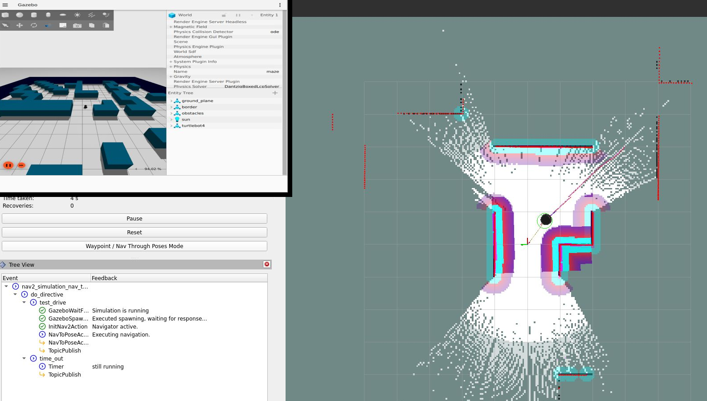

Tutorials
=========

Code for all tutorials is available in :repo_link:`examples`.

Define and Execute Scenario
---------------------------

To create a scenario in OpenSCENARIO 2.0 syntax, first create a file
with the extension ``.osc``. Input the following code in the file.

.. code-block::

   # import the libraries with import expression
   import osc.helpers

   # declare the scenario by the syntax: "scenario scenario_name:"
   scenario example_ros_topic:
       # define the content of the scenario with "do_directive"
       do serial:
           # log a message on the screen with "log" action from the built-in library
           log("Hello World")
           # emit the "end" event to signalize the end of the scenario
           emit end

The first line ``import osc.helpers`` will import the integrated library
``helpers.osc`` from the package “scenario_execution_base”. All the
OpenSCENARIO 2.0 definitions defined in the file will be imported.

.. note::
   Comments in OpenSCENARIO 2.0 always start with hashtag “#”.

Then, declare a scenario with the name ``example_ros_topic``. The following colon states that all following and indented lines
are part of it. The action of the scenario is defined in the ``do`` directive.
The term ``serial`` states that the included actions will be executed in sequence.

.. note::
   OpenSCENARIO 2.0 supports the following compositions:

   * ``parallel``: execute actions in parallel, continue afterwards
   * ``serial``: execute actions, one after the other
   * ``one_of``: execute actions in parallel, continue after one finished

Use the ``log`` action defined within the imported library to log a message ``Hello World!`` on the
screen. After the ``log`` action is invoked, the scenario emits an ``end`` event to tell the scenario execution to shut down
and return success on the scenario. On the other hand, if you want to define a condition where the scenario fails, use
``emit fail`` to shut down the scenario execution and return failure.

.. note::
   Scenario execution uses the predefined events ``end`` and ``fail`` to detect success or failure of a scenario.

Use this code to see a launch of this tutorial:

.. code-block:: bash

   colcon build --packages-up-to examples && source install/setup.bash \
   && ros2 launch scenario_execution scenario_launch.py scenario:=examples/example_scenario/scenarios/example_log.osc

.. _scenario_library:

Create Scenario Library
-----------------------

To add new features ti scenario execution, extensions libraries can be created. An extension library typically provides one or more
OpenSCENARIO 2.0 definition files and might additionally provide action implementations.

To show how to create such a library for scenario execution, we will add a ``custom_action`` action as an example.

First, we need to define the ``custom_action`` in a OpenSCENARIO 2.0 file.

.. code-block::

   action custom_action:
        data: string

The ``data`` parameter is used to pass the data of type string to the action plugin implementation.

Then, we can write the implementation of action plugin in Python.

.. code-block::

   import py_trees

   # define the py_trees behavior
   class CustomAction(py_trees.behaviour.Behaviour):

       # Override the __init__ function to accept parsed arguments.
       def __init__(self, name, data: str):
           super().__init__(name)
           self.data = data

       # Override the update function to define how the behavior is ticking.
       def update(self):
           print(f"Custom Action Triggered. Data: {self.data}")
           return py_trees.common.Status.SUCCESS

In the example, we created a custom action plugin to print a message on the
screen. The first step is to create a ``py_trees`` behavior for the action
plugin. First, override the ``__init__()`` function to accept the parsed
parameter from the action plugin. Beside the fixed parameter ``name`` all parameters defined within the OpenSCENARIO 2.0 file
are handed over to `__init__`. 
The action plugin ``custom_action`` only defines one parameter ``data``, so the behavior only has to accept ``data`` as an
argument. Then, override the ``update()`` function to define how the
behavior works. In this case, the behavior prints the message on the screen
and then returns success. Please refer to the ``py_trees`` `documentation <https://py-trees.readthedocs.io/en/devel/>`_ for details.

After we wrote the library, we need to add it to the
``scenario_execution.action_plugins`` and ``scenario_execution.osc_libraries`` entry points, so that the parser can
find it.

Open up the setup file for your Python package ``setup.py`` and add these lines to the
entry_points section.

.. code-block::

  entry_points={
   'scenario_execution.action_plugins': [
       'custom_action = example_library.custom_action:CustomAction',
   ],
    'scenario_execution.osc_libraries': [
        'example = example_library.get_osc_library:get_example_library',
    ]
  }

To ship the osc library, a ``MANIFEST.in`` must be created and ``include_package_data=True`` must be enabled within ``setup.py``.

Now, you can use the library and the action ``custom_action`` within your scenarios:

.. code-block::

    import osc.example

    scenario example_library:
        do serial:
            custom_action(data: 'foo')
            emit end

Use this code to see a launch of this tutorial:

.. code-block:: bash

   colcon build --packages-up-to example_library && source install/setup.bash \
   && ros2 launch scenario_execution scenario_launch.py scenario:=examples/example_library/scenarios/example_library.osc

Create Navigation Scenario
--------------------------

A simple example scenario for spawning a simulated Turtlebot4 in Gazebo
and control it with Nav2, can be found in :repo_link:`examples/example_nav2/example_nav2.osc`.

This scenario files looks as follows:

::

    import osc.ros

    scenario nav2_simulation_nav_to_pose:
        turtlebot4: differential_drive_robot
        do parallel:
            test_drive: serial:
                turtlebot4.init_nav2(pose_3d(position_3d(x: 0.0m, y: 0.0m)))
                turtlebot4.nav_to_pose(pose_3d(position_3d(x: 3.0m, y: -3.0m)))
                turtlebot4.nav_to_pose(pose_3d(position_3d(x: 0.0m, y: 0.0m)))
                emit end
            time_out: serial:
                wait elapsed(120s)
                emit fail

Let’s break down the individual components of the scenario. The
following snippet defines the turtlebot4 amr-object.

.. code-block::

   turtlebot4: differential_drive_robot:            # define turtlebot4 robot

The ``do parallel`` runs the actual test drive and a time-out in
parallel. In case something goes wrong, the time-out prevents the
scenario from running indefinitely by canceling it after 2 minutes and
marking it as failed.

Before being able to navigate, nav2 needs to be initialized. This
includes setting the initial pose of the Nav2 localization module
`AMCL <https://wiki.ros.org/amcl>`__.

.. code-block::

   turtlebot4.init_nav2(pose_3d(position_3d(x: 0.0m, y: 0.0m)))                        # initialize Nav2

Finally, the following snippet calls the Nav2 `NavigateToPose
action <https://github.com/ros-planning/navigation2/blob/main/nav2_msgs/action/NavigateToPose.action>`__
to make the robot navigate to a specified goal pose and back to the
starting position

.. code-block::

    turtlebot4.nav_to_pose(pose_3d(position_3d(x: 3.0m, y: -3.0m)))
    turtlebot4.nav_to_pose(pose_3d(position_3d(x: 0.0m, y: 0.0m)))

Once the robot reached the final goal pose ``emit end`` finishes the
scenario and marks it as successful.

To try this example, run

.. code-block:: bash

   ros2 launch tb4_sim_scenario sim_nav_scenario_launch.py scenario:=examples/example_nav2/example_nav2.osc headless:=False

and you should see something like this

.. figure:: images/tb4_scenario.gif
   :alt: turtlebot4 nav2 scenario

   Turtlebot4 NAV2 scenario

In case you want to run the navigation with SLAM instead of AMCL, update
the scenario file as described above and then run

.. code-block:: bash

   ros2 launch tb4_sim_scenario sim_nav_scenario_launch.py scenario:=examples/example_nav2/example_nav2.osc headless:=False slam:=True

and you should see something like this

   Turtlebot4 NAV2 scenario SLAM

Create Navigation Scenario with Obstacle
----------------------------------------

In this section, we’ll extend the previous example and use the :repo_link:`scenario_execution/action_plugins/tf_close_to.py`.
to spawn a static obstacle in front of the robot once it reaches a
user-specified reference point. The corresponding scenario can be found
in :repo_link:`examples/example_simulation/scenarios/example_simulation.osc`.

This scenario only differs from the previous scenario regarding the
definition of the obstacle itself and the condition, when to spawn it.
Here, we’ll only look at the differences to the previous scenario. At
the beginning, we define a box, which will be needed as static obstacle
during the scenario

.. code-block::

    box: amr_object with:
        keep(it.model == 'example_simulation://models/box.sdf')

Next, we’ll have a look at how to spawn the box when the robot reaches a
certain location. The following scenario snippet shows, how this is
done.

.. code-block::

    parallel:
        serial:
            turtlebot4.nav_to_pose(pose_3d(position_3d(x: 3.0m, y: -3.0m)))
            turtlebot4.nav_to_pose(pose_3d(position_3d(x: 0.0m, y: 0.0m)))
        serial:
            turtlebot4.tf_close_to(
                reference_point: position_3d(x: 1.5m, y: -1.5m),
                threshold: 0.4m,
                robot_frame_id: 'turtlebot4_base_link_gt')
            box.spawn(
                spawn_pose: pose_3d(
                    position: position_3d(x: 2.0m, y: -2.0m, z: 0.1m),
                    orientation: orientation_3d(yaw: 0.0rad)),
                world_name: 'maze')

First, we wrap the navigation part in the first branch of a parallel
statement. This is necessary, as the condition if the robot reached the
reference-point needs to happen continuously in parallel to the
navigation action. This condition is checked with the ``tf_close_to``
action. Once the robot reaches the reference point, the box is spawned
as unmapped static obstacle in the robot’s way such that the navigation
stack needs to avoid it to reach its goal.

To try this example, run

.. code-block:: bash

    ros2 launch tb4_sim_scenario sim_nav_scenario_launch.py scenario:=examples/example_simulation/scenarios/example_simulation.osc headless:=False
