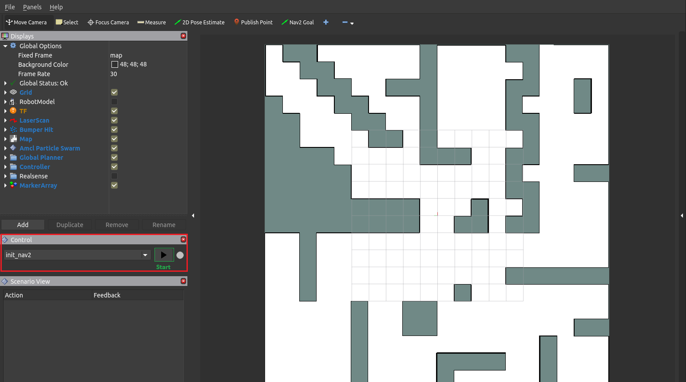
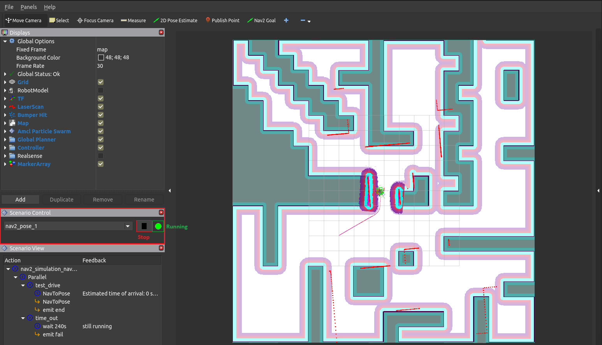

.. _tutorials:

Tutorials
=========

Code for all tutorials is available in :repo_link:`examples`.

Define and Execute Scenario
---------------------------

To create a scenario in OpenSCENARIO 2 syntax, first create a file
with the extension ``.osc``. Input the following code in the file.

.. code-block::

   # import the libraries with import expression
   import osc.standard.base
   import osc.helpers

   # declare the scenario by the syntax: "scenario scenario_name:"
   scenario hello_world:
       # define the content of the scenario with "do_directive"
       do serial: # execute children one after the other
           log("Hello World!") # log a message on the screen with "log" action from the built-in library
           wait elapsed(3s)   # wait three seconds
           log("Good Bye!")         # log another message

The first two lines ``import osc.standard.base`` and ``import osc.helpers`` will import the named libraries that provide required definitions. In this example ``helpers`` library provides the ``log`` action and ``standard.base`` provides the definition of the `s` unit to specify seconds.

.. note::
   Comments in OpenSCENARIO 2 always start with ``#``.

Then, a scenario with the name ``hello_world`` get declared. The following colon states that all following and indented lines
are part of it. The single top-level action of the scenario is defined in the ``do`` directive.
The term ``serial`` states that the included actions will be executed in sequence.

.. note::
   OpenSCENARIO 2 supports the following compositions:

   * ``parallel``: execute actions in parallel, continue afterwards
   * ``serial``: execute actions, one after the other
   * ``one_of``: execute actions in parallel, continue after one finished

Use the ``log`` action, defined within the imported library, to log a message ``Hello World!`` on the
screen. After the ``log`` action is invoked, the ``wait`` directive makes the scenario execution to wait for 3 seconds. Afterwards another ``log`` action is triggered and the scenario ends afterwards.

.. note::
   Scenario execution uses the predefined events ``end`` and ``fail`` to detect success or failure of a scenario. If no ``emit end`` or ``emit fail`` is defined, a success is assumed.

.. note::
    It is good practice to define a timeout modifier within a scenario to avoid that failing scenarios run forever.

    .. code-block::
        
        scenario example:
            timeout(60s)
            do serial:
                ...

Use this code to see a launch of this tutorial:

.. code-block:: bash

   colcon build --packages-up-to scenario_execution_ros && source install/setup.bash \
   && ros2 launch scenario_execution_ros scenario_launch.py scenario:=examples/example_scenario/hello_world.osc

.. _scenario_library:

Create Scenario Library
-----------------------

To add new features to scenario execution, extensions libraries can be created. An extension library typically provides one or more
OpenSCENARIO 2 definition files and might additionally provide action implementations.

To show how to create such a library for scenario execution, we will add a ``custom_action`` action as an example.

First, we need to define the ``custom_action`` in a OpenSCENARIO 2 file.

.. code-block::

   action custom_action:
        data: string

The ``data`` parameter is used to pass the data of type string to the action plugin implementation.

Then, we can write the implementation of action plugin in Python.

.. code-block::

   from scenario_execution.actions.base_action import BaseAction

   class CustomAction(BaseAction):

       def __init__(self, data: str):
           super().__init__()

       def execute(self, data: str):
           self.data = data

       def update(self):
           print(f"Custom Action Triggered. Data: {self.data}")
           return py_trees.common.Status.SUCCESS

In the example, we created a custom action plugin to print a message on the
screen. The first step is to create an action implementation, based on the class ``BaseAction``. 
There are two methods that can be overloaded in order to receive the action arguments as defined in the osc file. 
The first is the ``__init__()`` function which gets the argument values as they get initialized during parsing the scenario file.
The second is the ``execute()`` function which gets the argument values as they are currently defined at the time the action gets executed.
This allows to initialize the action and then set the latest values just before the action gets triggered.

The action plugin ``custom_action`` only defines one parameter ``data``, so the behavior only has to accept ``data`` as an
argument. Then, override the ``update()`` function to define how the
behavior works. In this case, the behavior prints the message on the screen
and then returns success. Please refer to the ``py_trees`` `documentation <https://py-trees.readthedocs.io/en/devel/>`_ for details.

After we wrote the library, we need to add it to the
``scenario_execution.actions`` and ``scenario_execution.osc_libraries`` entry points, so that the parser can
find it.

Open up the setup file for your Python package ``setup.py`` and add these lines to the
entry_points section.

.. code-block::

  entry_points={
   'scenario_execution.actions': [
       'custom_action = example_library.custom_action:CustomAction',
   ],
    'scenario_execution.osc_libraries': [
        'example = example_library.get_osc_library:get_example_library',
    ]
  }

To ship the osc library, a ``MANIFEST.in`` must be created and ``include_package_data=True`` must be enabled within ``setup.py``.

Now, you can use the library and the action ``custom_action`` within your scenarios:

.. code-block::

    import osc.example

    scenario example_library:
        do serial:
            custom_action(data: 'foo')
            emit end

Use this code to see a launch of this tutorial:

.. code-block:: bash

   colcon build --packages-up-to example_library && source install/setup.bash \
   && ros2 launch scenario_execution_ros scenario_launch.py scenario:=examples/example_library/scenarios/example_library.osc

Create Navigation Scenario
--------------------------

A simple example scenario for spawning a simulated Turtlebot4 in Gazebo
and control it with Nav2, can be found in :repo_link:`examples/example_nav2/example_nav2.osc`.

This scenario files looks as follows:

::

    import osc.ros

    scenario nav2_simulation_nav_to_pose:
        robot: differential_drive_robot
        do parallel:
            test_drive: serial:
                robot.init_nav2(pose_3d(position_3d(x: 0.0m, y: 0.0m)))
                robot.nav_to_pose(pose_3d(position_3d(x: 3.0m, y: -3.0m)))
                robot.nav_to_pose(pose_3d(position_3d(x: 0.0m, y: 0.0m)))
                emit end
            time_out: serial:
                wait elapsed(120s)
                emit fail

Let’s break down the individual components of the scenario. The
following snippet defines the turtlebot4 amr-object.

.. code-block::

   turtlebot4: differential_drive_robot:            # define turtlebot4 robot

The ``do parallel`` runs the actual test drive and a time-out in
parallel. In case something goes wrong, the time-out prevents the
scenario from running indefinitely by canceling it after 2 minutes and
marking it as failed.

Before being able to navigate, nav2 needs to be initialized. This
includes setting the initial pose of the Nav2 localization module
`AMCL <https://wiki.ros.org/amcl>`__.

.. code-block::

   turtlebot4.init_nav2(pose_3d(position_3d(x: 0.0m, y: 0.0m)))                        # initialize Nav2

Finally, the following snippet calls the Nav2 `NavigateToPose
action <https://github.com/ros-planning/navigation2/blob/main/nav2_msgs/action/NavigateToPose.action>`__
to make the robot navigate to a specified goal pose and back to the
starting position

.. code-block::

    turtlebot4.nav_to_pose(pose_3d(position_3d(x: 3.0m, y: -3.0m)))
    turtlebot4.nav_to_pose(pose_3d(position_3d(x: 0.0m, y: 0.0m)))

Once the robot reached the final goal pose ``emit end`` finishes the
scenario and marks it as successful.

To try this example, run

.. code-block:: bash

   ros2 launch tb4_sim_scenario sim_nav_scenario_launch.py scenario:=examples/example_nav2/example_nav2.osc headless:=False

and you should see something like this

.. figure:: images/tb4_scenario.gif
   :alt: turtlebot4 nav2 scenario

   Turtlebot4 NAV2 scenario

In case you want to run the navigation with SLAM instead of AMCL, update
the above described scenario by setting the ``use_initial_pose`` to ``False``:

::

    import osc.ros

    scenario nav2_simulation_nav_to_pose:
        robot: differential_drive_robot
        do parallel:
            test_drive: serial:
                robot.init_nav2(
                    initial_pose: pose_3d(position_3d(x: 0.0m, y: 0.0m)),
                    use_initial_pose: false)
                robot.nav_to_pose(pose_3d(position_3d(x: 3.0m, y: -3.0m)))
                robot.nav_to_pose(pose_3d(position_3d(x: 0.0m, y: 0.0m)))
                emit end
            time_out: serial:
                wait elapsed(120s)
                emit fail

Then, run:

.. code-block:: bash

   ros2 launch tb4_sim_scenario sim_nav_scenario_launch.py scenario:=examples/example_nav2/example_nav2.osc headless:=False slam:=True

and you should see something like this

.. figure:: images/tb4_scenario_slam.PNG
   :alt: turtlebot4 nav2 scenario SLAM

   Turtlebot4 NAV2 scenario SLAM

Create Navigation Scenario with Obstacle
----------------------------------------

In this section, we’ll extend the previous example and use the :repo_link:`scenario_execution/actions/tf_close_to.py`.
to spawn a static obstacle in front of the robot once it reaches a
user-specified reference point. The corresponding scenario can be found
in :repo_link:`examples/example_simulation/scenarios/example_simulation.osc`.

This scenario only differs from the previous scenario regarding the
definition of the obstacle itself and the condition, when to spawn it.
Here, we’ll only look at the differences to the previous scenario. At
the beginning, we define a box, which will be needed as static obstacle
during the scenario

.. code-block::

    box: osc_object

Next, we’ll have a look at how to spawn the box when the robot reaches a
certain location. The following scenario snippet shows, how this is
done.

.. code-block::

    parallel:
        serial:
            turtlebot4.nav_to_pose(pose_3d(position_3d(x: 3.0m, y: -3.0m)))
            turtlebot4.nav_to_pose(pose_3d(position_3d(x: 0.0m, y: 0.0m)))
        serial:
            turtlebot4.tf_close_to(
                reference_point: position_3d(x: 1.5m, y: -1.5m),
                threshold: 0.4m,
                robot_frame_id: 'turtlebot4_base_link_gt')
            box.spawn(
                spawn_pose: pose_3d(
                    position: position_3d(x: 2.0m, y: -2.0m, z: 0.1m),
                    orientation: orientation_3d(yaw: 0.0rad)),
                model: 'example_simulation://models/box.sdf')

First, we wrap the navigation part in the first branch of a parallel
statement. This is necessary, as the condition if the robot reached the
reference-point needs to happen continuously in parallel to the
navigation action. This condition is checked with the ``tf_close_to``
action. Once the robot reaches the reference point, the box is spawned
as unmapped static obstacle in the robot’s way such that the navigation
stack needs to avoid it to reach its goal.

To try this example, run

.. code-block:: bash

    ros2 launch tb4_sim_scenario sim_nav_scenario_launch.py scenario:=examples/example_simulation/scenarios/example_simulation.osc headless:=False

Create Scenarios with Variations
--------------------------------
In this example, we'll demonstrate how to generate and run multiple scenarios using only one scenario definition.

For this we'll use the  :repo_link:`scenario_coverage/scenario_coverage/scenario_variation`. to save the intermediate scenario models in ``.sce`` extension file and then use :repo_link:`scenario_coverage/scenario_coverage/scenario_batch_execution` to execute each generated scenario.

The scenario file looks as follows:

.. code-block::

    import osc.helpers

    scenario test_log:
        do serial:
            log() with:
                keep(it.msg in ["foo", "bar"])
            emit end

Here, a simple scenario variation example using log action plugin is created and two messages ``foo`` and
``bar`` using the array syntax are passed.

As this is not a concrete scenario, ``scenario_execution`` won't be able to execute it. Instead we'll use ``scenario_variation`` from the ``scenario_coverage`` package to generate all variations and save them to intermediate scenario model files with ``.sce`` extension.
Afterwards we could either use ``scenario_execution`` to run each created scenario manually or make use of ``scenario_batch_execution`` which reads all scenarios within a directory and executes them one after the other.

Now, lets try to run this scenario. To do this, first build Packages ``scenario_execution`` and ``scenario_coverage``:

.. code-block::

    colcon build --packages-up-to scenario_execution_ros && colcon build --packages-up-to scenario_coverage

* Now, create intermediate scenarios with ``.sce`` extension using the command:

.. code-block:: bash

    scenario_variation examples/example_scenario_variation/example_scenario_variation.osc

In the command mentioned above we passed the scenario file as the parameter. You can also specify the output directory for the scenario files using the ``-t`` option. If not specified, the default folder ``out`` will be created in the current working directory.

* Next, ``run scenario files`` with following command.

.. code-block:: bash

    scenario_batch_execution -i out -o scenario_output -- ros2 launch scenario_execution scenario_launch.py scenario:={SCENARIO} output_dir:={OUTPUT_DIR}

Let's break down this command.
In the first part we run the executable ``scenario_batch_execution``. This requires the following parameters to execute.

    1. Directory where the scenario files ``.sce`` were saved as the input option ``-i``.
    2. Directory where the output ``log`` and ``xml`` files will be saved as the output option ``-o``.
    3. Launch command to launch scenarios ``-- ros2 launch scenario_execution_ros scenario_launch.py scenario:={SCENARIO} output_dir:={OUTPUT_DIR}``.

Finally, The output of the above command will display two values ``foo`` and ``bar`` on the terminal along with the success message.

Control Scenarios with Rviz
---------------------------
In this example, let's learn how to control multiple scenarios directly from ``RVIZ`` control panel.

We'll use :repo_link:`examples/example_scenario_control/` as the base package to launch scenes turtlebot4 inside the simulation environment.

You can add your custom scenario files to the scenario folder inside the package. However, for this tutorial, we'll use the existing scenarios present there. Let's run an example.

First, build the package using the following command:

.. code-block:: bash

    colcon build --packages-up-to examples/example_scenario_control

Now, run the following command to launch the simulation:

.. code-block:: bash

    ros2 launch example_scenario_control example_scenario_control_launch.py

Both Gazebo and Rviz will launch. Now, you can use the control panel to select a specific scenario from the drop-down list. Run it by clicking the play icon, as shown in the figure below:

   Scenario Control Start

When the scenario starts, the small circle will turn green, as shown below:

   Scenario Control Running

In this tutorial, we have three scenarios. The first, ``init_nav2``, initializes the robot. The other two, ``nav_to_paose_1`` and ``nav_to_pose_2``, navigate the robot to specific poses.

After completing the initialization scenario, you can run any of the ``nav_to_pose`` scenarios using the drop-down menu.

.. note::

    While the scenario is running, you can click the stop/pause button to terminate it. Afterwards, you have the option to either start the same scenario again or choose another one.

Currently, terminating the scenario will not stop the ongoing navigation, and the robot will continue to move towards its goal pose. However, please note that this behavior will be addressed in future updates.

Use External Methods
--------------------

It is possible to call external python methods and use their return value within a scenario. A basic example of this functionality can be found in :repo_link:`examples/example_external_method/` providing a factorial method.

.. code-block::

    import osc.standard.base
    import osc.helpers

    struct lib:
        def factorial(n: int) -> int is external example_external_method.external_methods.factorial.factorial()

    scenario example_external_method:        
        do serial:
            log(lib.factorial(4))

The external method, defined within a python module (in this example ``example_external_method.external_methods.factorial.factorial()``) is referenced within an osc definition with the same signature using the ``external`` keyword.

.. note::

    The osc definition of an external method needs to be placed within a composition type (e.g. a ``struct``) and can be called by using ``<struct-name>.<method-name>``.
 

Use this code to see a launch of this tutorial:

.. code-block:: bash

   colcon build --packages-up-to example_external_method && source install/setup.bash \
   && ros2 run scenario_execution scenario_execution examples/example_external_method/scenarios/example_external_method.osc
