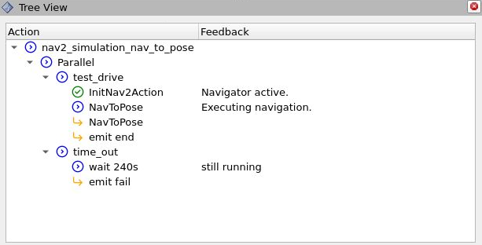

# Scenario Execution Rviz

The `scenario_execution_rviz` package provides [rviz](https://github.com/ros2/rviz) plugins for visualizing and controlling the scenario when working with [ROS 2](https://docs.ros.org/en/rolling/index.html).

## Scenario View Panel

The Scenario View panel shows the behavior tree of the running scenario. The panel is accessible under Panels :arrow_right: Add new panel :arrow_right: scenario_execution_rviz :arrow_right: ScenarioView.
The following image shows a snapshot of the rviz plugin during a run of the [example_nav2](../examples/example_nav2/example_nav2.osc) scenario:

### Known Issues

The Scenario View panel can not display the scenario's behavior tree if initialized while the robot navigation is already running.

### Icon Licence

The MIT License (MIT)
Copyright © 2019-2020 css.gg
